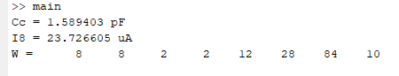
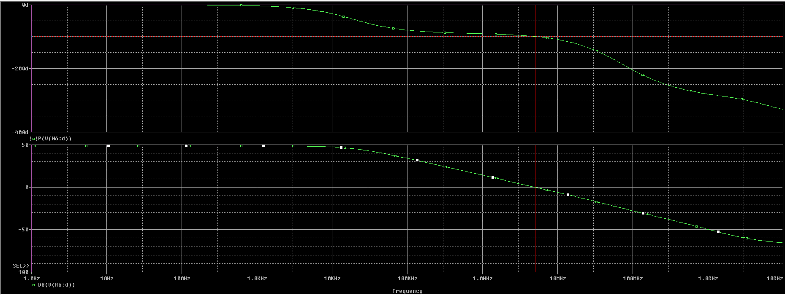
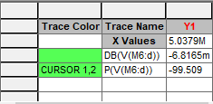
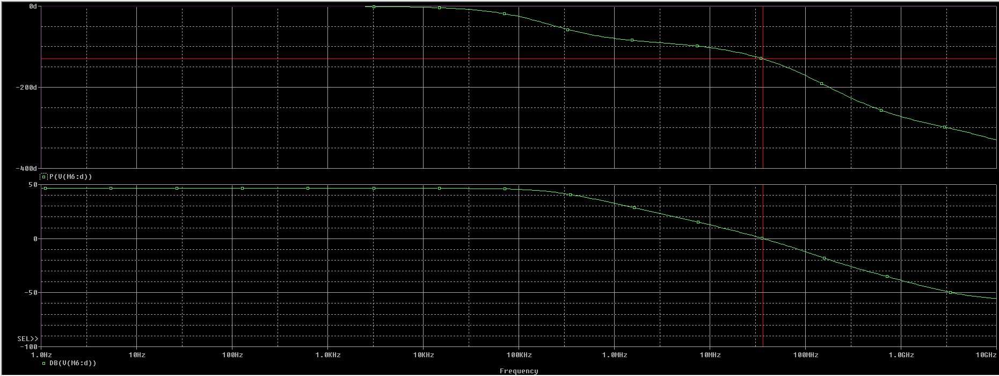
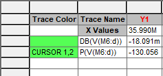

# Ηλεκτρονική III - Εργασία Σχεδίασης Τελεστικού Ενισχυτή

**Κατσάρος Ζήσης, ΑΕΜ. 10666**  
**Ιανουάριος 2025**

## Εισαγωγή

Στην παρούσα εργασία θα σχεδιαστεί τελεστικός ενισχυτής δύο σταδίων με είσοδο p-mos και ιδανική πηγή ρεύματος στην θέση του κυκλώματος πόλωσης, σύμφωνα με τις ζητούμενες προδιαγραφές.  
Αρχικά θα δοθούν πρωταρχικές τιμές για τις διαστάσεις των τρανζίστορ και για την χωρητικότητα Miller, ύστερα από μαθηματικούς υπολογισμούς. Εν συνεχεία θα υλοποιηθεί αλγόριθμος σε Matlab ο οποίος αυτοματοποιεί την παραπάνω διαδικασία. Βάσει των τιμών που υπολογίστηκαν θα προσομοιωθεί το κύκλωμα χρήση του Spice και τέλος θα τροποποιηθούν οι τιμές ώστε να πληρούνται οι ζητούμενες προδιαγραφές.

## Προδιαγραφές/ Δεδομένα

- $C_L=2.66pF$
- $SR>18.66V/\mu sec$
- $V_{dd}=1.998V$
- $V_{ss}=-1.998V$
- $GB>7.66MHz$
- $A>20.66dB$
- $P<50.66mW$
- $45^{\circ}<PM<60^{\circ}$

## Μαθηματικός υπολογισμός των στοιχείων

Για τους παρακάτω υπολογισμούς θα χρησιμοποιηθούν $k_n=100\mu A/V^2$ και $k_p=50\mu A/V^2$. Ακολουθεί ο μαθηματικός σχεδιασμός του ενισχυτή:  
Αρχικά, το περιθώριο φάσης υπολογίζεται ως εξής:

$$PM=180^{\circ}-tan^{-1}(\frac{\omega}{|p_1|})-tan^{-1}(\frac{\omega}{|p_2|})-tan^{-1}(\frac{\omega}{z})$$

Για την οριακή περίπτωση όπου $PM\leq60^{\circ}$, $\omega=GB$ και με την συνθήκη $z\geq10GB$ έχουμε

$$60^{\circ}\geq180^{\circ}-90^{\circ}-tan^{-1}(\frac{GB}{|p_2|})-tan^{-1}(0.1)\Rightarrow$$
$$tan^{-1}(\frac{GB}{|p_2|})\leq24.29^{\circ}\Rightarrow$$
$$\frac{GB}{|p_2|}\leq0.4515\Rightarrow$$

$$|p_2|\geq2.2158GB$$

Από την συνθήκη $z\geq10GB$ έχουμε:

$$z\geq10GB\Rightarrow$$
$$\frac{g_{m6}}{C_c}\geq10\cdot\frac{g_{m1}}{C_c}\Rightarrow$$

$$g_{m6}\geq10g_{m1}$$

Από την ανίσωση (1):

$$|p_2|\geq2.2158GB$$
$$\frac{g_{m6}}{C_L}\geq2.2158\cdot\frac{g_{m1}}{C_c}\Rightarrow$$
$$C_c\geq2.2158\cdot\frac{g_{m1}}{g_m{6}}\cdot C_L\xRightarrow{(2)}$$
$$C_c\geq0.22158\cdot C_L\Rightarrow$$
$$C_c\geq0.5894pF$$

Διαλέγω $C_c=2.5pF$. Επιπλέον από την προδιαγραφή για το Slew Rate έχουμε:

$$SR>18.66V/\mu sec\Rightarrow$$
$$\frac{I_5}{C_C}>18.66\cdot10^6\Rightarrow$$
$$I_5>18.66\cdot10^6\cdot2.5\cdot10^{-12}\Rightarrow$$
$$I_5>46.64\mu A$$

Διαλέγω το μικρότερο δυνατό για να διασφαλίσω μικρή κατανάλωση. Επομένως $I_5=46.64\mu A$.  
Από τον τύπο για την $V_{in_{min}}$:

$$V_{in_{min}}=V_{ss}+\sqrt{\frac{I_5}{\beta_3}}+V_{T_{3_{max}}}-|V_{T_1}|_{min}\Rightarrow$$
$$\beta_3=I_5\cdot(V_{in_{min}}-V_{ss}-V_{T_{3_{max}}}+|V_{T_1}|_{min}\Rightarrow)^{-2}$$
$$\left(\frac{W}{L}\right)_3=\frac{I_5}{k_n}\cdot(V_{in_{min}}-V_{ss}-V_{T_{3_{max}}}+|V_{T_1}|_{min}\Rightarrow)^{-2}$$

και με τιμές που αντιστοιχούν στα δοθέντα netlist των τρανζίστορ προκύπτει ότι:

$$\left(\frac{W}{L}\right)_3\approx0.16$$

Θα διαλέξουμε όμως $\left(\frac{W}{L}\right)_3=1=\frac{2\mu m}{2\mu m}$. Επιπλέον επειδή τα $M_3$ και $M_4$ αποτελούν καθρέπτη ρεύματος θα ισχύει $\left(\frac{W}{L}\right)_3=\left(\frac{W}{L}\right)_4=\frac{2\mu m}{2\mu m}$.  
Συνεχίζοντας έχω:

$$g_{m1}=GB\cdot C_c\Rightarrow$$
$$g_{m1}=2\pi\cdot7.66\cdot10^6\cdot2.5\cdot10^{-12}\Rightarrow$$
$$g_{m1}=120.323\mu S=g_{m2}$$

Έτσι έχω

$$\left(\frac{W}{L}\right)_1=\left(\frac{W}{L}\right)_2=\frac{g_{m1}^2}{k_p\cdot I_5}\approx6.21$$

Διαλέγω $\left(\frac{W}{L}\right)_1=\left(\frac{W}{L}\right)_2=\frac{12\mu m}{2\mu m}$. Από την ανίσωση 2 έχω:

$$g_{m6}\geq10\cdot g_{m1}\Rightarrow$$
$$g_{m6}\geq1203.23\mu S$$

Διαλέγω $g_{m6}=1203.23\mu S$  
Επίσης

$$g_{m4}=\sqrt{2\cdot k_n\cdot\left(\frac{W}{L}\right)_4\cdot I_5}=68.3\mu S$$

Έτσι

$$\left(\frac{W}{L}\right)_6=\left(\frac{W}{L}\right)_4\cdot\frac{g_{m6}}{g_{m4}}\approx17.62$$

Διαλέγω $\left(\frac{W}{L}\right)_6=\frac{36\mu m}{2\mu m}$. Επιπλέον από τον τύπο για την $V_{in_max}$ έχουμε

$$V_{SD_{5_{sat}}}=V_{dd}-V_{in_max}-\sqrt{\frac{I_5}{\beta_1}}-|V_{T_1}|_{max}\Rightarrow$$
$$V_{SD_{5_{sat}}}=0.49V$$

Και έτσι μπορούμε να υπολογίσουμε την επιφάνεια του $M_5$ ως εξής:

$$\left(\frac{W}{L}\right)_5=\frac{2\cdot I_5}{k_p\cdot V_{SD_{5_{sat}}}^2}=7.66$$

Διαλέγω $\left(\frac{W}{L}\right)_5=\frac{16\mu m}{2\mu m}$.  
Επιπλέον

$$I_6=\frac{g_{m6}^2}{2\cdot k_n\cdot\left(\frac{W}{L}\right)_6}\approx208.99\mu A$$

$$\left(\frac{W}{L}\right)_7=\left(\frac{W}{L}\right)_5\cdot\frac{I_6}{I_5}=\frac{84\mu m}{2\mu m}$$

Τέλος αν διαλέξω $I_{ref}=0.8\cdot I_5=37.32$ έχω:

$$\left(\frac{W}{L}\right)_8=\left(\frac{W}{L}\right)_5\cdot\frac{I_{ref}}{I_5}=6.4$$

Επομένως $\left(\frac{W}{L}\right)_8=\frac{12\mu m}{2\mu m}$.

## Αποτελέσματα του αλγορίθμου

Αφότου γίνει αρχικοποίηση των δεδομένων και εκτελεστεί ο αλγόριθμος, επιστρέφει το εξής:

 
*Αποτελέσματα του αλγορίθμου*

## Ανάλυση στο Spice

Μετά από την υλοποίηση του αλγόριθμου στο Matlab κατασκευάστηκε το κύκλωμα το ενισχυτή στο Spice με τιμές επιλεγμένες ως εξής:

- $C_c= 1.589pF$
- $I_{ref}=23.72\mu A$
- και τιμές $W = \{8, 8, 2, 2, 12, 28, 84, 10\}$

") 
*Κύκλωμα τελεστικού ενισχυτή με τις αρχικές τιμές (Spice)*

Τρέχοντας μία AC analysis παρατηρείται ότι το περιθώριο φάσης είναι περίπου $80^{\circ}$.

 
*Γραφήματα μέτρου και φάσης κέρδους*

 
*Τιμή φάσης όταν |A|=0dB*

Για να μειώσουμε το περιθώριο φάσης αρκεί να αυξήσουμε τα ρεύμα $I_5$ ή να αυξήσουμε την διαγωγιμότητα των $M_1$ και $M_2$. Ύστερα από τροποποιήσεις στις τιμές των στοιχείων του κυκλώματος επιτεύχθηκε η ικανοποίηση όλων των περιγραφών όταν οι τιμές επιλέχθηκαν ως εξής:

- $C_c= 0.59pF$
- $I_{ref}=50\mu A$
- και τιμές $W = \{32, 32, 2, 2, 20, 20, 84, 6\}$

") 
*Κύκλωμα τελεστικού ενισχυτή με τις τελικές τιμές (Spice)*

Με τις συγκεκριμένες τιμές επιτεύχθηκαν:

- $SR=36.683GV/\mu sec$
- $GB=1504.85MHz$
- $A=46.36dB$
- $P=3.296mW$
- $PM=55^{\circ}$

Το $GB$ υπολογίστηκε ως $GB=A_{DC}\cdot f_c$ και το $P$ ως $P=(I_5+I_6)\cdot(V_{dd}+|V_{ss}|$ με τιμές από το κύκλωμα. Οι προσομοιώσεις για τις υπόλοιπες προδιαγραφές φαίνονται παρακάτω:

 
*Γραφήματα μέτρου και φάσης κέρδους*

 
*Τιμή φάσης όταν |A|=0dB*

 
*Slew Rate*
